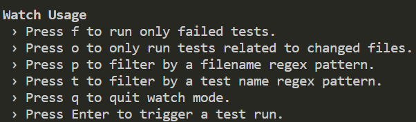
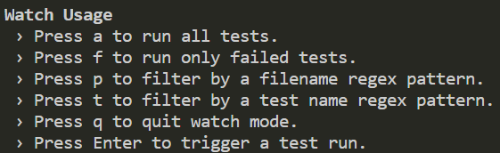

# Jest 命令行工具的使用

## Jest CLI Options

- watch：监视文件以获取更改并重新运行与已更改文件```相关的测试```，默认会进入```o模式```。并且当前项目需要是通过git管理的项目，主要针对当前代码与git仓库的代码进行比较。Jest才能知道哪个文件做了修改，才会重新执行修改的文件相关的测试用例。
- watchAll：监视文件以进行更改，并在发生更改时重新运行```所有测试```，默认会进入```a模式```。

- 修改package.json，监听文件变化，自动运行测试。命令行会生成```Watch Usage```。
  
  ```script
  "scripts": {
    "test": "jest --watchAll"
  },
  ```

  

- 修改package.json，监听文件变化，自动运行测试。命令行会生成```Watch Usage```。
  
  ```script
  "scripts": {
    "test": "jest --watch"
  },
  ```

  

## Watch Usage

- f；只会重新测试之前失败的测试用例。
- o：需要配合Git使用。记录哪个文件进行了修改。重新测试修改文件相关的测试用例。
- p：根据测试文件的文件名的正则表达式，来过滤需要执行的测试用例。只执行通过正则的测试用例。
- t：根据测试用例的名字的正则表达式，来过滤需要执行的测试用例。只执行通过正则的测试用例。
  - 测试用例的名字：test后面的描述文字
- q：退出监控
- Enter：按Enter重新执行测试
