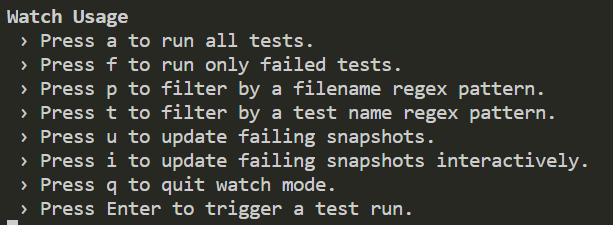
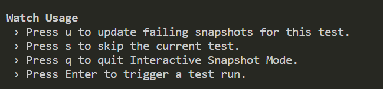

# snapshot 快照测试

所谓snapshot，即快照也。通常涉及UI的自动化测试，思路是把某一时刻的标准状态拍个快照，在测试回归的时候进行pixel to pixel的对比。

会在第一次运行的时候生成快照，后面在运行测试时会生成新的快照。新的快照会与就的快照对比。不一样则测试失败。

每当你想要确保你的UI不会有意外的改变，快照测试是非常有用的工具。

## 更新快照

如果组件渲染结果发生变化，测试将会失败。当组件正常调整时，我们可以调用 ```jest -u``` 更新快照。如果有多个快照，只需要更新部分快照，我们可以调用 ```jest -i``` 更新指定的快照。在监控模式下，我们可以通过交互式的命令更新快照。



部分更新快照 ```jest -i```



## Inline Snapshots（内联快照）

默认情况下，使用快照，在当前项目目录下会生成一个```__snapshots__```文件夹，里面会生成```.snap```文件，存放快照数据。

内联快照的行为与外部快照（.snap文件）完全相同，但生成的快照值内容会自动嵌入到测试用例源代码中。 这意味着您可以获得自动生成的快照的好处，而无需切换到外部文件以确保写入正确的值。

内联快照由```Prettier```提供支持。 要使用内联快照，您必须在项目中安装```Prettier```。

```javascript
test("will check the matchers and pass", () => {
  const user = {
    createdAt: new Date(),
    id: Math.floor(Math.random() * 20),
    name: "LeBron James"
  };

  expect(user).toMatchInlineSnapshot(
    {
      createdAt: expect.any(Date),
      id: expect.any(Number)
    },
    `
    Object {
      "createdAt": Any<Date>,
      "id": Any<Number>,
      "name": "LeBron James",
    }
  `
  );
});
```

## Property Matchers

通常，要生成的对象中存在自动生成的字段（如ID和日期）。如果您尝试对这些对象进行快照，它们将在每次运行时强制快照失败：

```javascript
test('will fail every time', () => {
    const user = {
        createdAt: new Date(),
        id: Math.floor(Math.random() * 20),
        name: 'LeBron James',
    };

    expect(user).toMatchSnapshot();
});
```

对于这些情况，Jest允许为任何属性提供不对称匹配器。在编写或测试快照之前检查这些匹配器，然后将其保存到快照文件而不是接收到的值：

```javascript
test('will check the matchers and pass', () => {
    const user = {
        createdAt: new Date(),
        id: Math.floor(Math.random() * 20),
        name: 'LeBron James',
    };

    expect(user).toMatchSnapshot({
        createdAt: expect.any(Date),
        id: expect.any(Number),
    });
});
```

[演示代码](../source_code/01)